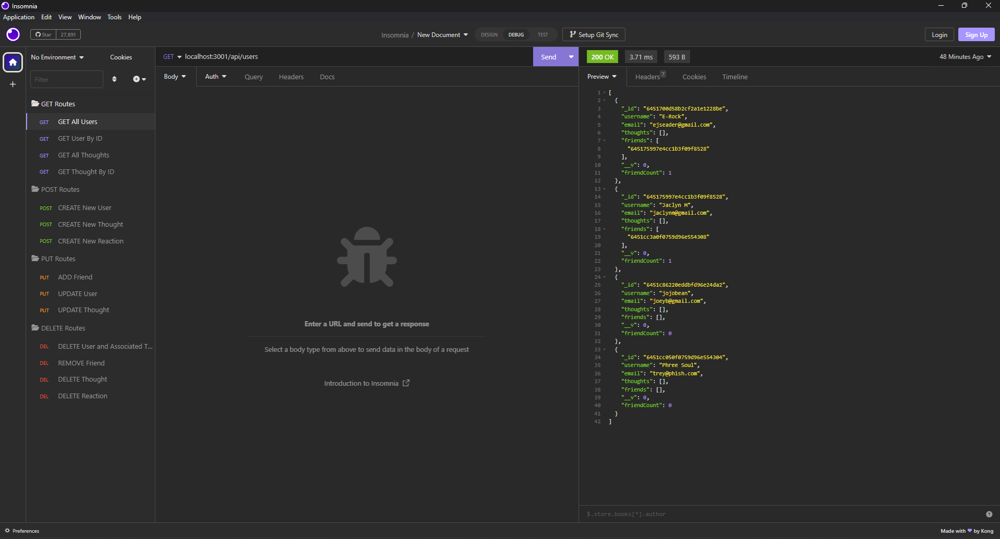
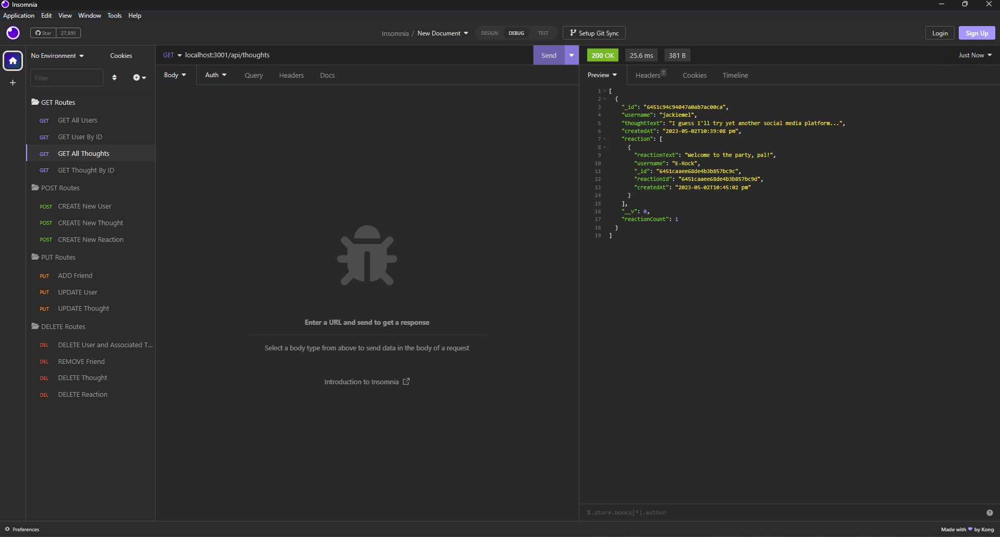
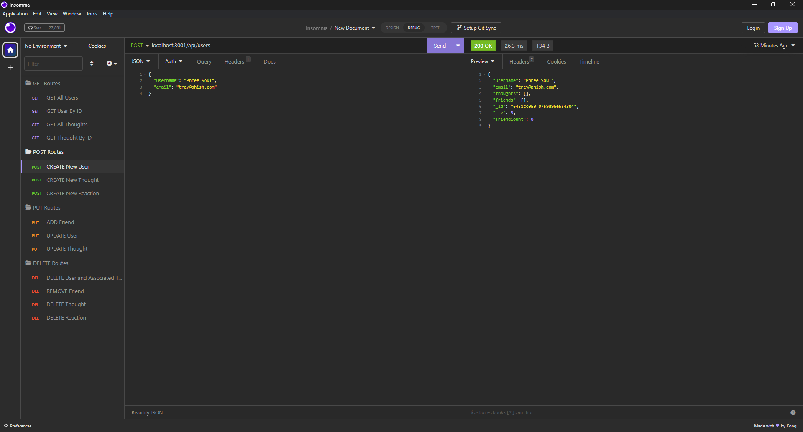
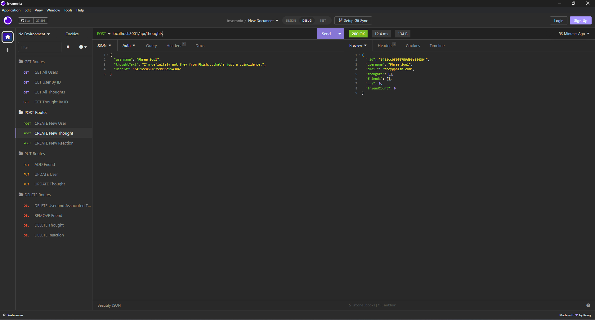
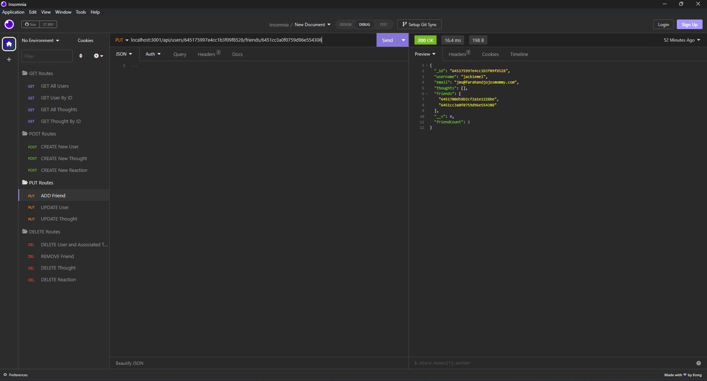
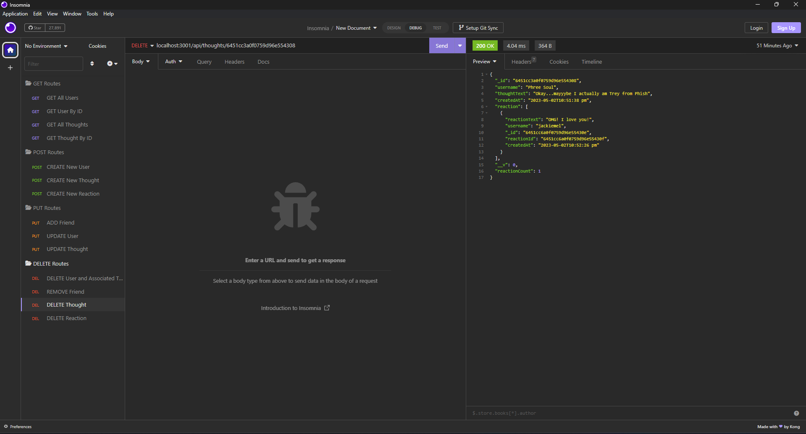
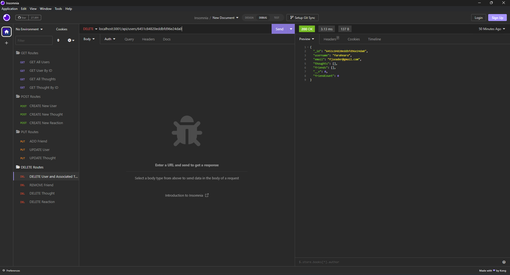

# Module 18 - NoSQL Challenge: Social Network API

## Summary 

Using Express, a MongoDB database, Mongoose, and DayJS, our "challenge was to build an API for a social network web application where users can share their thoughts, react to friends’ thoughts, and create a friend list." (Source: Module 18 README)

---

## Table of Contents
* [Screencaps](#screencaps)
* [Walkthrough Video](#walkthrough-video)
* [Installation and Usage](#installation-and-usage)  
* [License](#license)
* [Contributing](#contributing)
* [Contact](#contact)

---

## Screencaps

 
 
 
 
 
 
 
 <br><br>

--- 

## Walkthrough Video

### [Walkthrough Video of Social Network API](https://drive.google.com/file/d/1Dz6H04qbpupf-03erfFIfXdGs7LTqB16/view) <br><br>

---

## Installation and Usage  

The app is built in the [Node.js](https://nodejs.org) environment, utilizing the npm packages [Express](https://www.npmjs.com/package/express). [Mongoose](https://mongoosejs.com), and [DayJS](https://day.js.org).

To launch the API, please install the necessary packages and issue the run command:
``` 
npm i
npm start
```  
Once packages have been installed and the server is running, launch an [Insomnia](https://insomnia.rest) session to test the all CRUD functionalities.
<br><br>

---

## License
This project carries with it the [MIT License](https://opensource.org/licenses/MIT)<br><br>

---

## Contributing
For any comments, suggestions, or otherwise, please feel free to contact me.<br><br>

---

## Contact
Please contact me with any questions:
<ul>
<li>GitHub: <a href="https://github.com/ejseader">@ejseader</a></li>
<li>Email: <a href="mailto:ejseader@gmail.com">ejseader@gmail.com</a></li>
</ul>